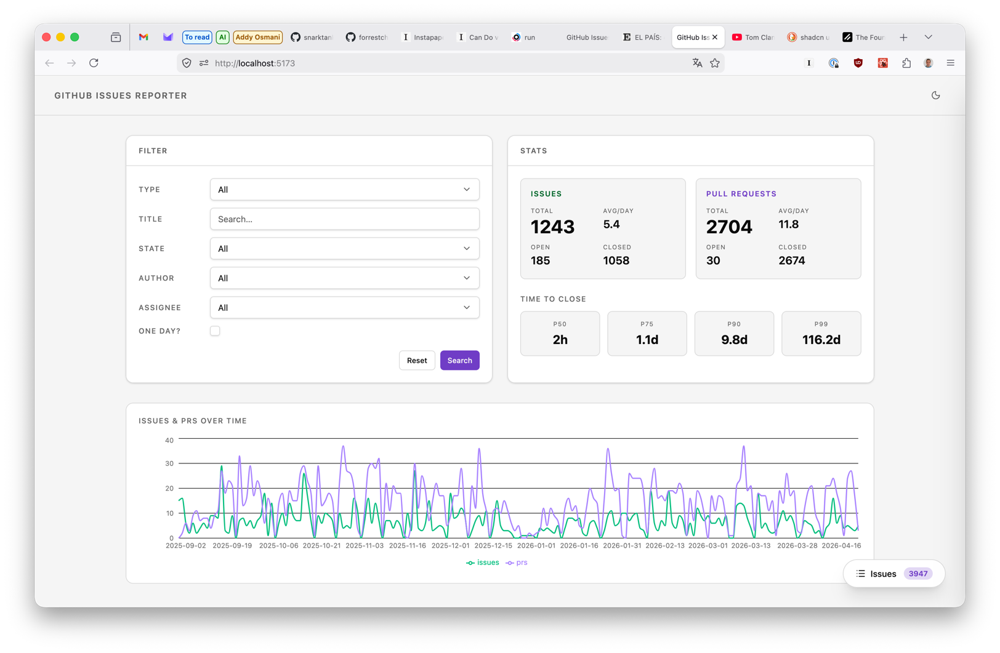

# GitHub Intelligence

> Collect GitHub issues and pull requests, explore them in your browser.


---

GitHub Intelligence is a monorepo that lets you pull issues and PRs from any GitHub repository for a given date range, cache them locally, and explore them through an interactive web dashboard — without keeping any remote infrastructure running.



## Features

- Fetch issues and pull requests for any public or private GitHub repository
- Filter by date range
- Cache results locally — repeat queries are instant, no API calls made
- Interactive web dashboard with:
  - Summary stats (total, open, closed)
  - Issues and PRs over time chart
  - Filterable tables by author and assignee
  - Tabbed views: all items, same-day closures, still open, by author
- GitHub Enterprise support via a configurable base URL

## Built with

- [TypeScript](https://www.typescriptlang.org/) — strict, `NodeNext` module resolution throughout
- [Turborepo](https://turbo.build/) — monorepo task orchestration
- [@octokit/rest](https://github.com/octokit/rest.js) — GitHub REST API client
- [flat-cache](https://github.com/royriojas/flat-cache) — local disk cache
- [Express](https://expressjs.com/) — API server
- [React](https://react.dev/) + [Vite](https://vitejs.dev/) — web dashboard
- [Recharts](https://recharts.org/) — data visualisation
- [Commander](https://github.com/tj/commander.js/) — CLI argument parsing

## Getting started

### Prerequisites

- Node.js >= 20
- npm >= 10
- A [GitHub personal access token](https://github.com/settings/tokens) (recommended to avoid rate limits)

### Installation

```bash
git clone https://github.com/your-org/github-intelligence.git
cd github-intelligence
npm install
npm run build
```

### Collect issues and PRs

```bash
export GITHUB_TOKEN=ghp_your_token_here

# Collect the last month of activity
node apps/cli-runner/dist/index.js --repo facebook/react

# Or specify a date range
node apps/cli-runner/dist/index.js --repo facebook/react --from 2024-01-01 --to 2024-03-31
```

### Open the dashboard

```bash
cd apps/reporter
GITHUB_TOKEN=ghp_your_token_here npm run dev
```

Then visit [http://localhost:5173](http://localhost:5173).

## Project structure

```
github-intelligence/
├── apps/
│   ├── cli-runner/        # CLI — collects and prints issues/PRs
│   └── reporter/          # Web dashboard — Express API + React SPA
└── packages/
    ├── issues-collector/  # Core library — GitHub API + local cache
    └── tsconfig/          # Shared TypeScript configuration
```

## Environment variables

| Variable          | Used by       | Description                                         |
| ----------------- | ------------- | --------------------------------------------------- |
| `GITHUB_TOKEN`    | CLI, Reporter | GitHub personal access token                        |
| `GITHUB_BASE_URL` | CLI           | GitHub API base URL (GitHub Enterprise)             |
| `CACHE_FOLDER`    | CLI, Reporter | Local cache directory (default: `.cache/`)          |
| `PORT`            | Reporter      | HTTP port for the reporter server (default: `3001`) |

Both apps load `.env` files automatically via `dotenv`.

## Development

```bash
npm test          # run all tests
npm run type-check  # type-check all packages
npm run build     # build all packages and apps
npm run clean     # remove all build artifacts
```

## Contributing

Pull requests are welcome. For significant changes, open an issue first to discuss what you'd like to change.

## License

MIT
