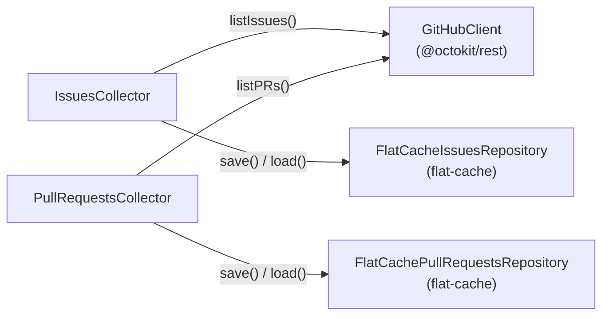

# @github-intelligence/issues-collector

Library for fetching GitHub issues and pull requests for a repository within a date range and caching the results to the local filesystem.

## Architecture



**GitHubClient** — wraps `@octokit/rest` and queries the GitHub Search API. Accepts an optional token and base URL for GitHub Enterprise.

**IssuesCollector / PullRequestsCollector** — orchestrate fetching and caching. On first call they hit the API and persist results; subsequent calls with the same key return the cached data without a network request.

**FlatCacheIssuesRepository / FlatCachePullRequestsRepository** — persist data to disk using `flat-cache`. The default directory is `.cache/issues-collector/` and `.cache/prs-collector/` respectively. Both implement their repository interface, so you can swap in any storage backend.

### Cache key

The cache key is `<owner>/<repo>/<from ISO>/<to ISO>`. Two requests for the same repository and date range always hit the same cache entry.

## Installation

```bash
npm install @github-intelligence/issues-collector
```

Set a GitHub personal access token to avoid rate limiting:

```bash
export GITHUB_TOKEN=ghp_your_token_here
```

## Usage

### Collect issues

```ts
import {
  GitHubClient,
  FlatCacheIssuesRepository,
  IssuesCollector,
} from "@github-intelligence/issues-collector";

const collector = new IssuesCollector(
  new GitHubClient(), // reads GITHUB_TOKEN from env
  new FlatCacheIssuesRepository(), // caches to .cache/issues-collector/
);

const issues = await collector.collect({
  owner: "facebook",
  repo: "react",
  from: new Date("2024-01-01"),
  to: new Date("2024-01-31"),
});
```

### Collect pull requests

```ts
import {
  GitHubClient,
  FlatCachePullRequestsRepository,
  PullRequestsCollector,
} from "@github-intelligence/issues-collector";

const collector = new PullRequestsCollector(
  new GitHubClient(),
  new FlatCachePullRequestsRepository(),
);

const prs = await collector.collect({
  owner: "facebook",
  repo: "react",
  from: new Date("2024-01-01"),
  to: new Date("2024-01-31"),
});
```

### Custom token and cache directory

```ts
const client = new GitHubClient("ghp_your_token", "https://github.mycompany.com/api/v3");
const repo = new FlatCacheIssuesRepository("/tmp/my-cache");
```

### Bring your own repository

```ts
import type { IssuesRepository, GitHubIssue } from "@github-intelligence/issues-collector";

class MyRepository implements IssuesRepository {
  save(key: string, issues: GitHubIssue[]): void {
    /* ... */
  }
  load(key: string): GitHubIssue[] | undefined {
    /* ... */
  }
  loadAll(): GitHubIssue[] {
    /* ... */
  }
}
```

The same interface exists for `PullRequestsRepository`.

## Types

```ts
interface GitHubIssue {
  id: number;
  number: number;
  repository: string;
  title: string;
  body: string | null;
  state: string;
  createdAt: string;
  updatedAt: string;
  closedAt: string | null;
  url: string;
  labels: string[];
  author: string;
  assignees: string[];
  type: "issue" | "pr";
}

interface FetchIssuesOptions {
  owner: string;
  repo: string;
  from: Date;
  to: Date;
}
```

## Technical decisions

- **`flat-cache` for persistence** — zero-config, file-based key/value store that writes JSON to disk. No database setup required; the cache folder can be committed or gitignored as needed.
- **Separate collectors for issues and PRs** — the GitHub Search API treats issues and pull requests as distinct resource types. Keeping them in separate collectors and repositories avoids mixing concerns while sharing the same `GitHubIssue` shape (disambiguated by the `type` field).
- **`@octokit/rest` for the GitHub API** — the official GitHub REST client; handles authentication, pagination, and rate-limit headers automatically.
