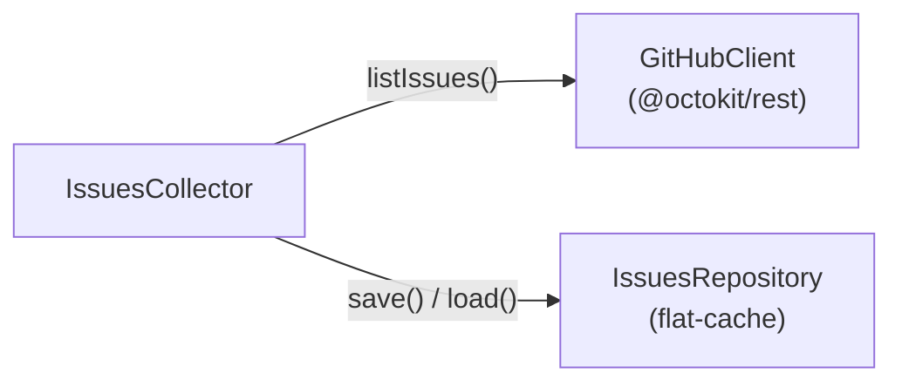

# @github-intelligence/issues-collector

Fetches GitHub issues for a repository within a date range and caches the results to the local filesystem.

## Architecture



- **GitHubClient** — queries the GitHub Search API via `@octokit/rest`
- **IssuesCollector** — orchestrates fetching and caching
- **IssuesRepository** — persists issues to disk using `flat-cache`

## Installation

```bash
npm install @github-intelligence/issues-collector
```

Set a GitHub personal access token to avoid rate limiting:

```bash
export GITHUB_TOKEN=your_token_here
```

## Usage

```ts
import {
  GitHubClient,
  FlatCacheIssuesRepository,
  IssuesCollector,
} from "@github-intelligence/issues-collector";

const collector = new IssuesCollector(
  new GitHubClient(),                    // reads GITHUB_TOKEN from env
  new FlatCacheIssuesRepository()        // caches to .cache/issues-collector/
);

const issues = await collector.collect({
  owner: "facebook",
  repo: "react",
  from: new Date("2024-01-01"),
  to: new Date("2024-01-31"),
});

console.log(issues);
```

### Custom token and cache directory

```ts
const collector = new IssuesCollector(
  new GitHubClient("ghp_your_token"),
  new FlatCacheIssuesRepository("/tmp/my-cache")
);
```

### Bring your own repository

```ts
import type { IssuesRepository, GitHubIssue } from "@github-intelligence/issues-collector";

class MyRepository implements IssuesRepository {
  save(key: string, issues: GitHubIssue[]): void { /* ... */ }
  load(key: string): GitHubIssue[] | undefined { /* ... */ }
}
```
