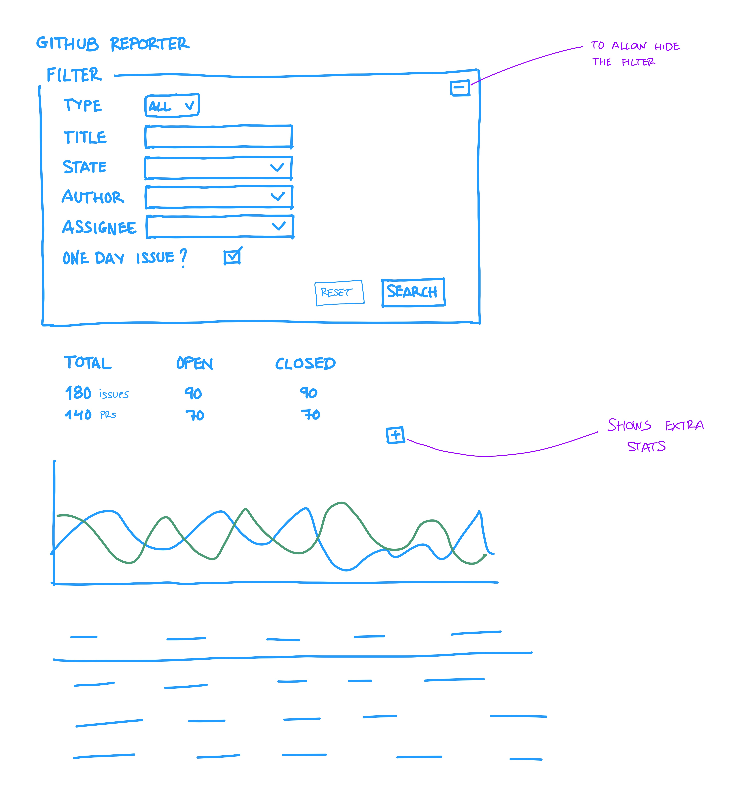

# Search Engine

The reporter application should be able to search in a finer way, and the UI should be intuitive.

This is the reference wirefram:

The filters are not at the table level anymore, and we are going to avoid the tabs for now.

The search form should be:
- Type: all by default, it can filter by PRs, or Issues only.
- Title: a partial match to the issue title.
- State: all by default, it can filter by open, or closed.
- Author: filter all elements with the given author (it must be a drop down with the existing values)
- Assignee: filter all elements with the given assignee (it must be a drop down with the existing values)
- One day only?: is a checkbox that filters all elements that open and closed the same date.

For the stats we have some default ones, and extra ones that are shown when clicked the + button, meanwhile are collapsed.
- Total issues
- Open issues
- Closed issues
- Total PRs
- Open PRs
- Closed PRs
- Average time to close (hidden by default)
- Median time to close (hidden by default)

At the reporter code, the search engine should be implemented in a way that it could be expanded with new search filters. And should be easy to read for humans.
